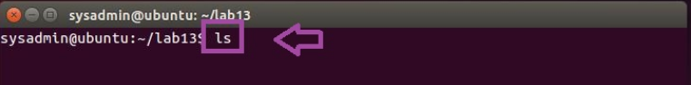

<h1>Cleaning Data (NormOut.txt)</h1>

<h2>Description</h2>
Project consists of removing the labels and special characters (periods and commas) from the NormOut.txt file.
<br />


<h2>Languages and Utilities Used</h2>

- <b>Python</b>

<h2>Environments Used </h2>

- <b>Ubuntu</b>

<h2>Program walk-through:</h2>

<p align="center">
List files in directory: <br/>

<br />
<br />
<br/>

<br />
<br />
<br/>

<br />
<br />
<br/>

<br />
<br />
Wait for process to complete (may take some time):  <br/>

<br />
<br />
<br/>

<br />
<br />
<br/>

</p>

<!--
 ```diff
- text in red
+ text in green
! text in orange
# text in gray
@@ text in purple (and bold)@@
```
--!>
